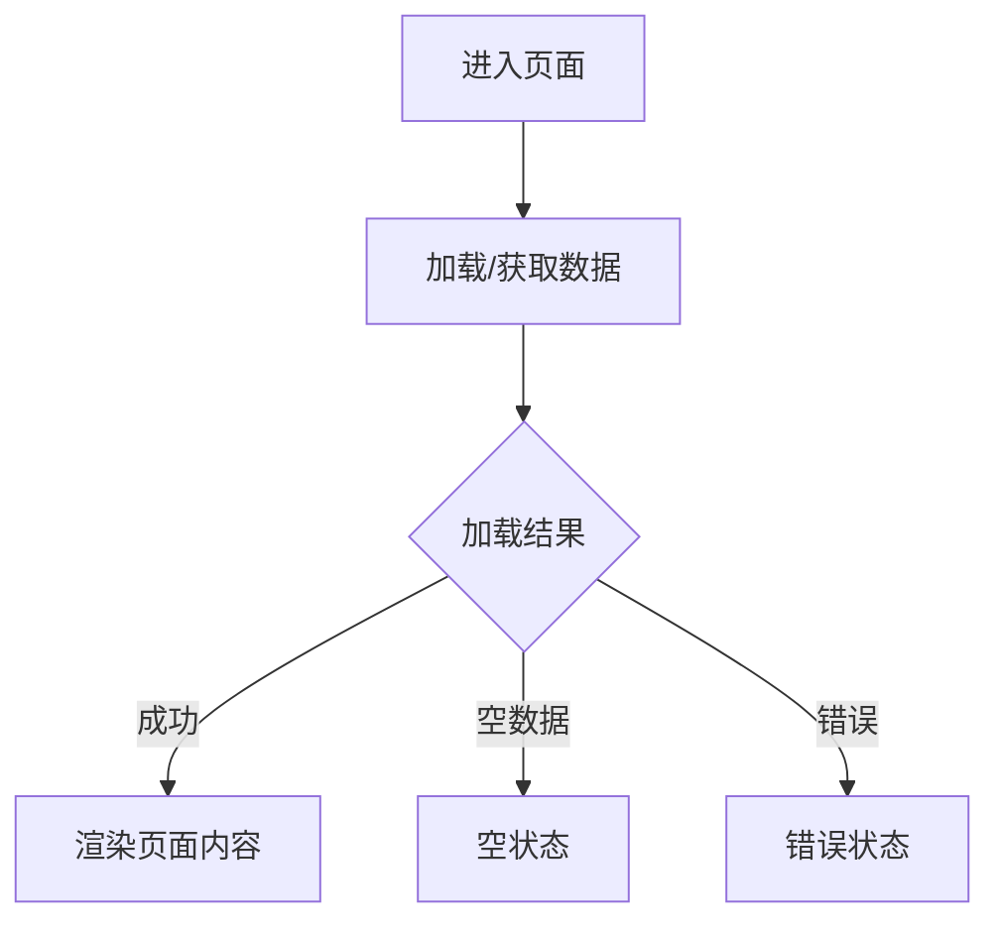
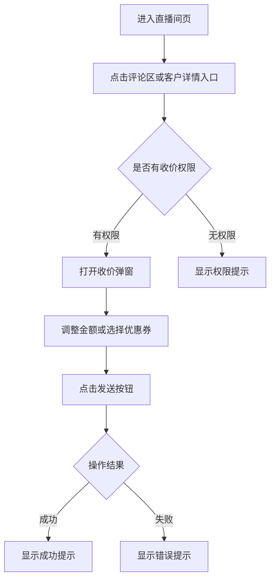

# 前端 PRD 专业性与完整性审查

## 概览

从**前端/交互**视角审查产品需求文档，确保专业性和完整性。按**页面维度**组织输出，识别缺失项和潜在风险。

## 关联规范（须先读）

审查任意 PRD 时，**须同时应用**仓库内独立文件（与作者是否使用 AI 无关）：

- [`references/fe-req-signal-noise.md`](references/fe-req-signal-noise.md)：有效信息是否凸显、噪声是否过高、能否映射到按页评审；输出 finding 类型与默认等级见该文。
- [`references/fe-req-design-deliverables.md`](references/fe-req-design-deliverables.md)：按系统类型（ToC / 中台后台）分层的设计交付物要求。

**输出顺序**：先按 `fe-req-signal-noise.md` 产出「信息结构 / 噪声」类 finding（可置于文首一节）；涉及 UI 变更时核对 `fe-req-design-deliverables.md`；再按本文下文的**页面边界**与**审查维度**逐页输出。

## 页面边界定义

- “页面”仅指 PRD 中的一级主页面，或具有独立导航入口/独立路由承载的页面。
- 弹窗、抽屉、浮层、二次确认框、上传框、内嵌 iframe 视图，不单独计入“页面总数”。
- 但弹窗、抽屉、浮层等必须作为其所属主页面的一部分进行诊断，不能忽略。
- 若某个弹窗/抽屉承载关键业务流程，也应在所属主页面下明确指出其问题与缺失。
- 除非用户明确要求“把弹窗/子页面单独拆开诊断”，否则禁止把弹窗、抽屉、浮层单独作为页面名称输出。

## 审查维度

### 1. 页面状态定义
- 加载中态：loading 时长、占位骨架或 loading 图
- 空状态：无数据时的空态设计（图标+文案+引导）
- 错误状态：网络错误/服务端错误/业务错误的提示和处理
- 成功态：操作成功后的反馈和跳转
- 禁用态：按钮/输入框不可用时的状态定义

### 2. 交互元素完整性
- 操作元素：按钮、链接的可用/禁用/加载状态
- 输入控件：输入框的校验规则、错误提示、字数限制
- 选择器：单选/多选/日期/地区选择器的展开/收起状态
- 切换控件：Tab/折叠面板/开关的状态同步
- 手势操作：下拉刷新、上拉加载、左右滑动、长按等

### 3. 边界条件和异常
- 数值边界：最大值、最小值、步长、默认值
- 内容边界：字数限制、列表数量限制、分页规则
- 时间边界：超时时间、重试间隔、缓存策略
- 网络异常：断网重连请求、弱网降级方案
- 权限异常：无权限/未登录的跳转和提示

### 4. 埋点完整性
- 只诊断 click（点击） 和 pageload（页面加载）两类新增埋点
- tracking_type 仅允许输出：click、pageload
- 不诊断曝光滚动、状态切换、自定义事件等其他类型埋点

### 5. 设计交付物（见 `references/fe-req-design-deliverables.md`）
- ToC 系统：必须提供设计稿；低保真/高保真原型不能单独作为设计交付物
- 中台/后台系统：可接受低保真或高保真原型；须在 PRD 标注交付物类型与链接
- 有 UI 变更但无对应依据时，在「问题与缺失」中记录

### 常见遗漏
- 只定义正常流程，忽略边界和异常
- 认为"业界常规做法"无需文档说明
- 埋点依赖前端自行判断，缺少明确需求
- 动效和过渡状态无说明

## 输出

### 页面总数
- 总页面数：N
- 说明：页面总数仅统计主页面，不包含弹窗、抽屉、浮层、确认框等。

## 强制输出规则

- 必须按**页面维度**逐页输出，禁止先按主题或全局维度汇总问题。
- 每个页面都必须单独产出一个完整区块，区块之间不可合并。
- 每个页面区块中的问题，必须覆盖该页面内部及其关联的弹窗、抽屉、浮层、二次确认框等交互。
- 每个页面区块内都必须包含：
  - `问题与缺失` 表格
  - `埋点建议（按页面）` 表格
- `问题与缺失` 表格中，必须增加一列用于标记问题归属区域。
- `归属区域` 不允许只写泛化类别，必须写成“类型 + 具体名称”的形式。
- 推荐写法示例：
  - `主页面-筛选区`
  - `主页面-任务列表`
  - `页面区块-数据概览`
  - `弹窗-管理集团门店`
  - `弹窗-上传过户资料`
  - `浮层-查看出价`
  - `浮层-近期成交记录`
  - `二次确认框-停售确认`
- 埋点建议必须**归属到当前页面**，禁止在文末输出“全局埋点建议汇总表”替代逐页埋点。
- 若某页面暂无明确埋点建议，也必须在该页面下写“暂无新增埋点建议”，不能省略。
- 埋点建议只输出 click 和 pageload 两类新增埋点，不要输出其他 tracking_type。
- 若用户未明确要求“全面诊断”，则不要输出组件/模块说明和流程图。

### 页面名称（逐页重复以下结构）

- 页面标题优先使用纯 Markdown 输出，避免 HTML 被当成普通文本展示。
- 推荐写法：
  - `## 登录页`
  - `## 账户设置`
---

> 该页面触发的弹窗、抽屉、浮层、确认框等交互，统一并入当前页面诊断，不单独起页面标题。

#### 涉及组件和模块说明

> 仅用户明确说明"全面诊断"时输出

- 组件：...
- 模块：...
- 说明：...

#### 页面交互逻辑汇总（流程图）

> 仅用户明确说明"全面诊断"时输出
> 流程图必须使用标准 Markdown Mermaid 代码块输出，不能只输出普通文本。
> 必须写成如下结构：
> - 代码块起始行为 ```mermaid
> - 第一行写 `flowchart TD`
> - 每条节点关系单独占一行
> - 条件分支使用 `-->|文案|` 语法
> - 普通步骤节点优先使用 `[]`，判断节点使用 `{}`



更复杂的页面流程可参考如下写法：



---

#### 问题与缺失

> **与代码对齐时强制规则（最高优先级）**：凡是“当前代码已存在合理实现，但 PRD 未提及”的项，一律**不是问题**，不得写入本表。
>
> **绝对禁止**出现这类句式（含同义改写）：
> - 「PRD 未定义 X，当前代码 Y」
> - 「PRD 未写 X，但代码已实现 Y，因此是问题」
> - 「代码已有 X，但仍建议在问题与缺失中补录」
>
> 以上内容仅允许放在文末「审查备注」一句话：`代码已有实现，建议 PRD 补录与代码对齐`。

| 维度 | 归属区域 | 问题描述 | 风险等级 | 建议方案 |
|-----|---------|---------|---------|---------|
| 状态定义 | 类型+具体名称，例如：主页面-筛选区 / 弹窗-管理集团门店 / 浮层-查看出价 | ... | P0/P1/P2 | ... |
| 交互元素 | 类型+具体名称，例如：主页面-筛选区 / 弹窗-管理集团门店 / 浮层-查看出价 | ... | P0/P1/P2 | ... |
| 边界异常 | 类型+具体名称，例如：主页面-筛选区 / 弹窗-管理集团门店 / 浮层-查看出价 | ... | P0/P1/P2 | ... |
| 埋点 | 类型+具体名称，例如：主页面-筛选区 / 弹窗-管理集团门店 / 浮层-查看出价 | ... | P0/P1/P2 | ... |

> 风险等级：
> - P0 (严重)：核心流程阻塞、数据丢失风险
> - P1 (中等)：用户体验断点、操作歧义
> - P2 (轻微)：文案不清晰、细节优化建议

---

#### 埋点建议（按页面）

> 该表必须放在**当前页面区块内**输出，不可挪到文末统一汇总。
> 只诊断当前页面的埋点；若无，则写“暂无新增埋点建议”。

> 只诊断 click（点击） 和 pageload（页面加载）两类新增埋点
> tracking_type 枚举仅允许：click（点击）、pageload（页面加载）
> 不要输出 event、exposure、scroll、change、custom 等其他类型
> `action` 仅作为表结构字段保留，默认留空，不需要填写内容。
> `扩展参数` 默认统一填写为“待产品定义”，不要自行推断具体字段。

| 埋点名称 | 事件类型（tracking_type） | pagekey | 页面名称 | module | 模块名称 | action | 控件名称 | 扩展参数 |
|---------|----------------------------|---------|----------|--------|----------|--------|----------|----------|
| 提交按钮点击 | click | page_order | 下单页 |  |  |  | 提交按钮 | 待产品定义 |
| 页面加载 | pageload | page_order | 下单页 |  |  |  | 页面 | 待产品定义 |

---

## 禁止输出示例

- **禁止**把“当前代码有、PRD未提及”写进 `问题与缺失`（包括状态、交互、埋点、校验、文案、按钮禁用态等）。
- **禁止**出现「PRD 未定义 X，当前代码 Y」这类对照式问题描述（无论风险等级 P0/P1/P2）。
- 不要输出“全局问题清单”“跨页面统一问题”“埋点汇总表（覆盖所有页面）”
- 不要把多个页面的埋点合并到一个表中
- 不要遗漏页面区块中的埋点建议部分
- 不要将弹窗、抽屉、浮层、上传框、确认框单独作为“页面名称”输出

## 输出前自检（必须执行）

在最终输出前，逐行检查 `问题与缺失`：

1. 若问题描述中出现“当前代码/代码中/现网已”且表达的是“代码已实现”，该行必须删除。
2. 若问题描述可改写为“PRD未提及，但代码已有”，该行必须删除。
3. 删除后若该页面无剩余问题，保留页面区块并在备注说明“代码已有实现，建议 PRD 补录对齐”。

## 常见触发语句

- "帮我 review 前端实现"
- "这个 PRD 有没有前端遗漏的点"
- "检查一下埋点是否完整"
- "页面状态定义是否完整"
